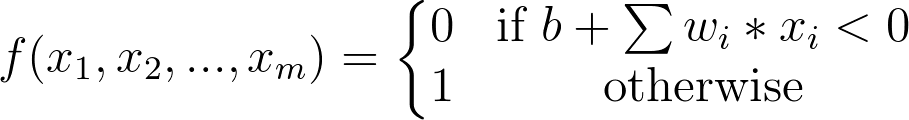

### What are the weights and bias for the AND perceptron?

Set the weights (`weight1`, `weight2`) and bias `bias` to the correct values that calculate AND operation as shown above.
In this case, there are two inputs as seen in the table above (let's call the first column `input1` and the second column `input2`), and based on the perceptron formula, we can calculate the output.

First, the linear combination will be the sum of the weighted inputs: `linear_combination = weight1 * input1 + weight2 * input2` then we can put this value into the biased Heaviside step function, which will give us our output (0 or 1):

Perceptron Formula