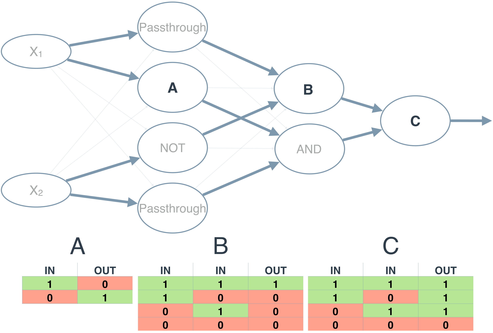

### XOR Perceptron

The neural network above calculates XOR. Each perceptron is a logic operation of OR, AND, Passthrough, or NOT. 
The Passthrough operation just passes it's input to the output. However, the perceptrons A , B, and C don't indicate their operation. 
In the following quiz, set the correct operations for the three perceptrons to calculate XOR.

Note: Any line with a low weight can be ignored.