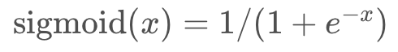
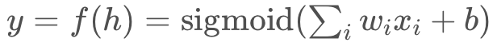

### Simple network exercise

Below you'll use Numpy to calculate the output of a simple network with two input nodes and one output node with a sigmoid activation function. Things you'll need to do:

+ Implement the sigmoid function.

+ Calculate the output of the network.

As a reminder, the sigmoid function is

For the exponential, you can use Numpy's exponential function, np.exp.

And the output of the network is

For the weights sum, you can do a simple element-wise multiplication and sum, or use Numpy's dot product function.