1_network
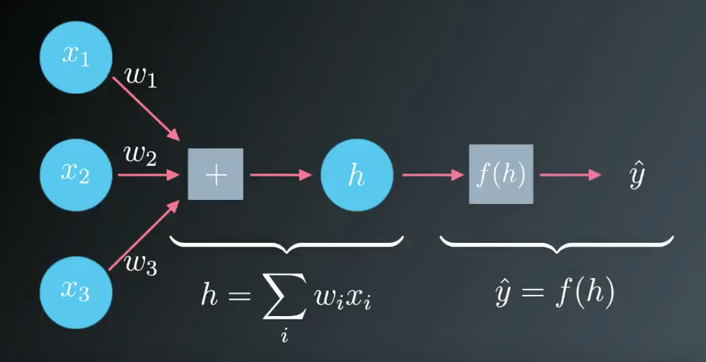

2_SSE
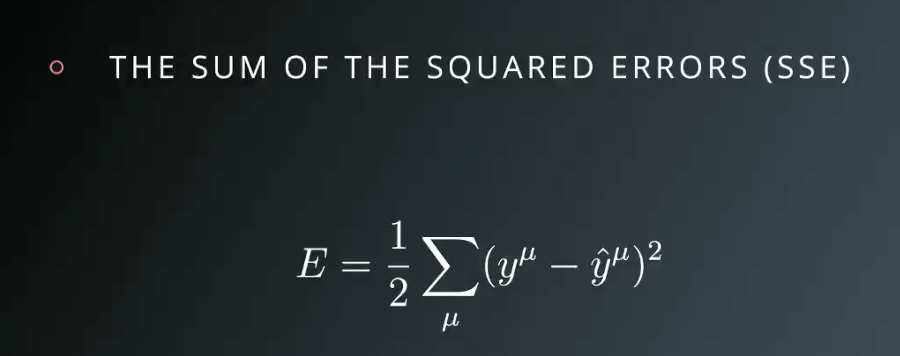

3_records_in_network
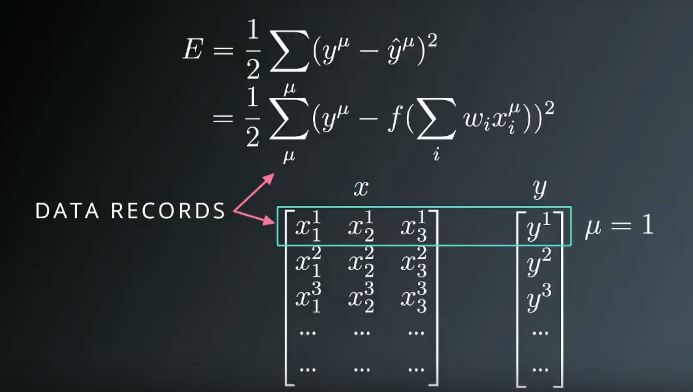

4_diagram_with_SSE
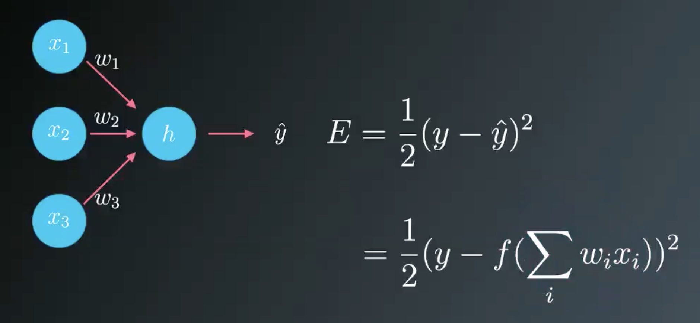

5_diagram_gradient_descent
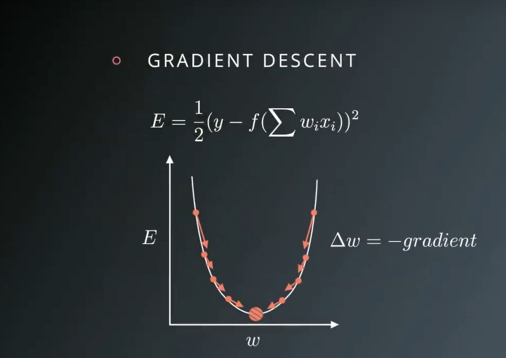

6_learning_rate
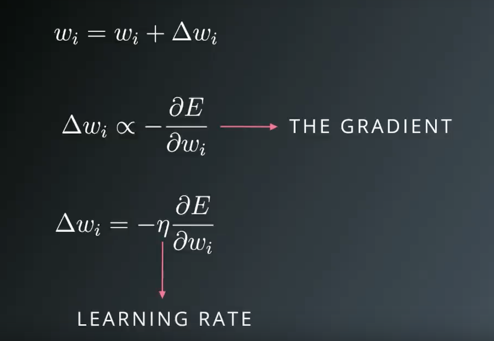

7_partial_differential
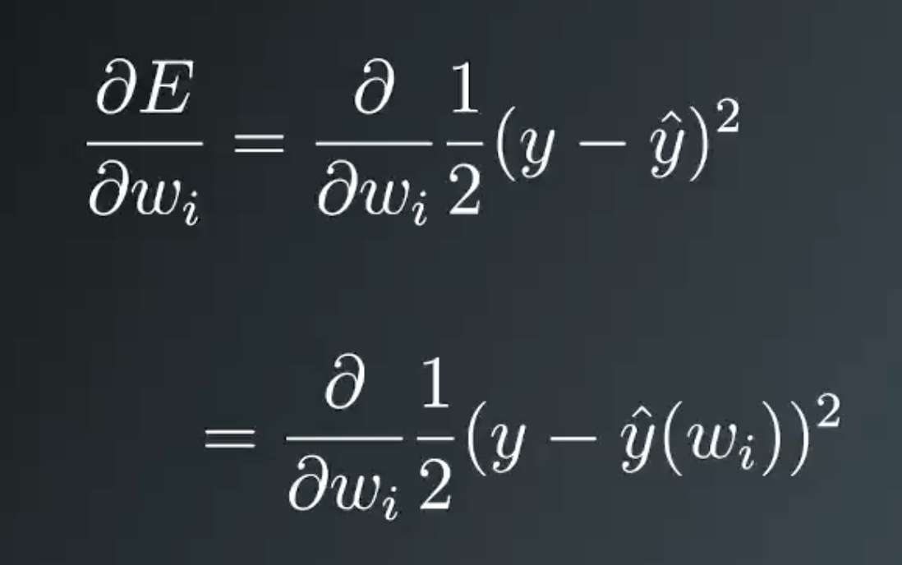

8_chain_rule
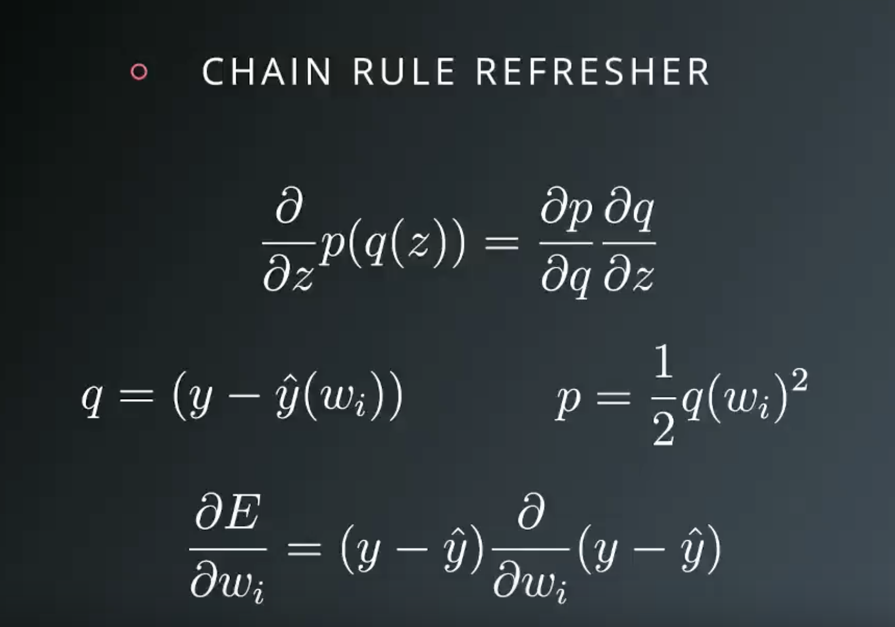

9_partial_differential_with_chain_rule
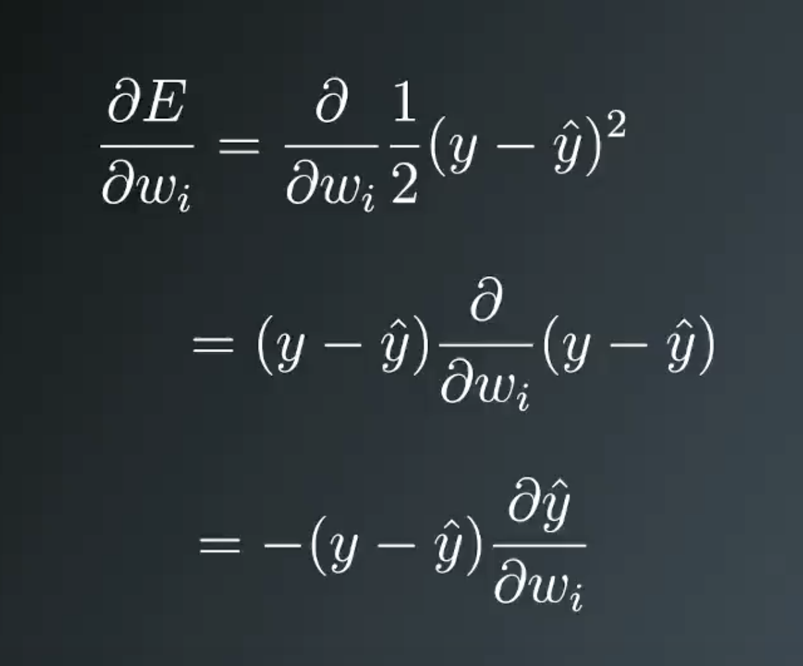

10_partial_differential_with_chain_rule_2
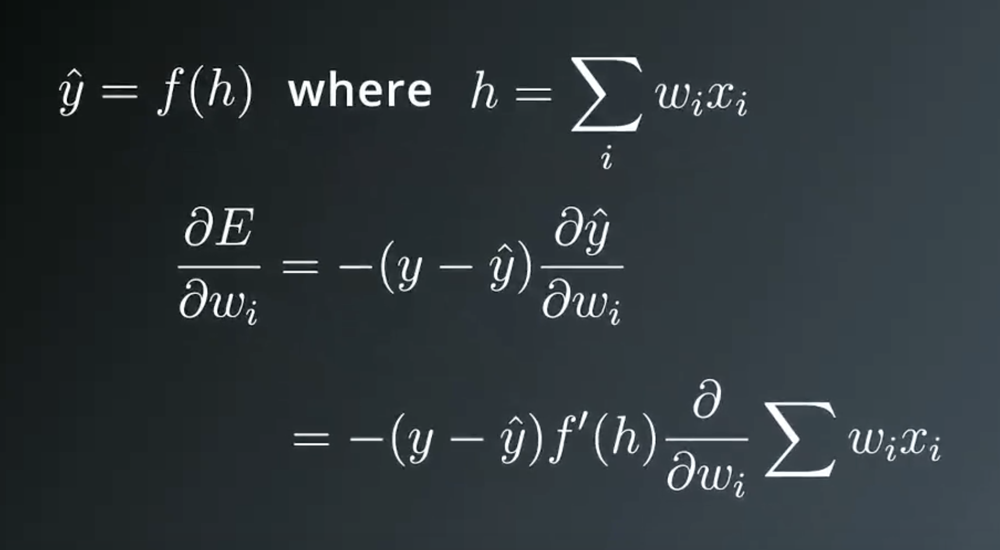

11_partial_differential_with_chain_rule_3
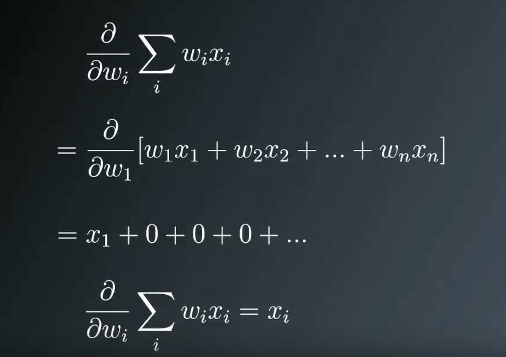

12_partial_differential_with_chain_rule_4
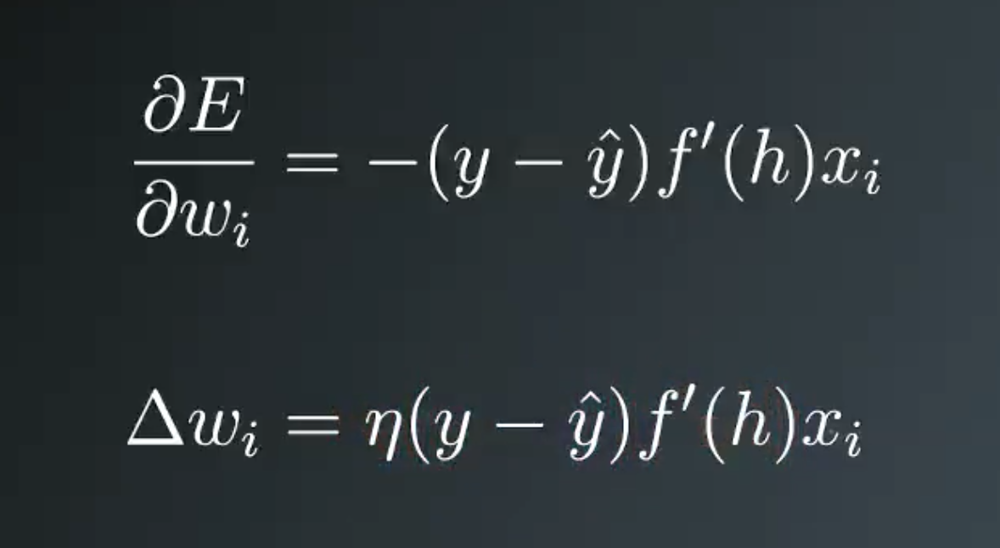

13_error_term
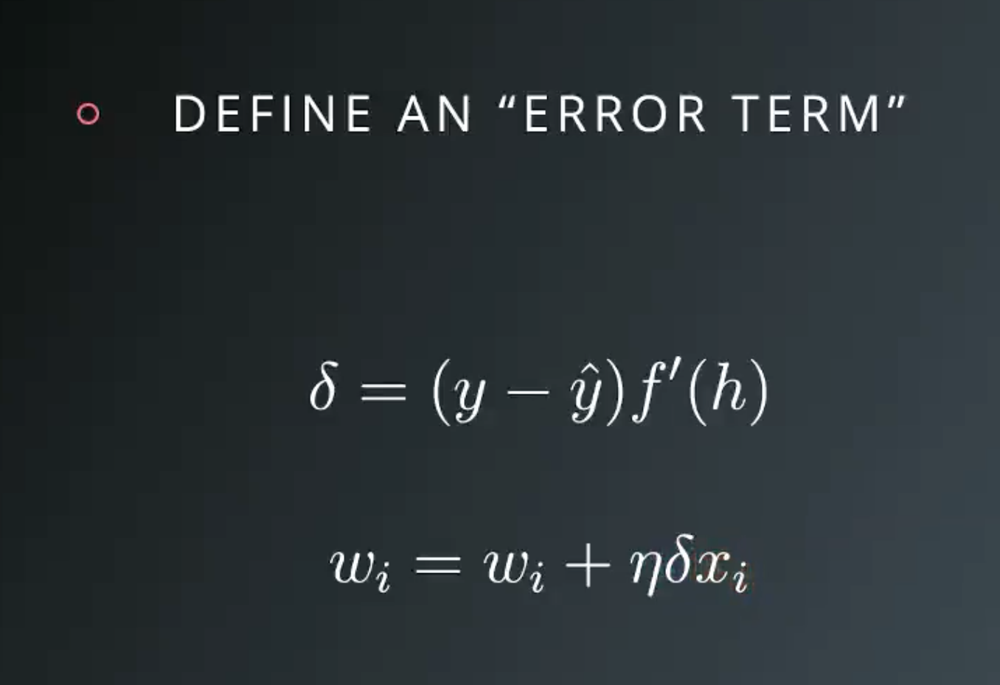

14_delta_of_weight
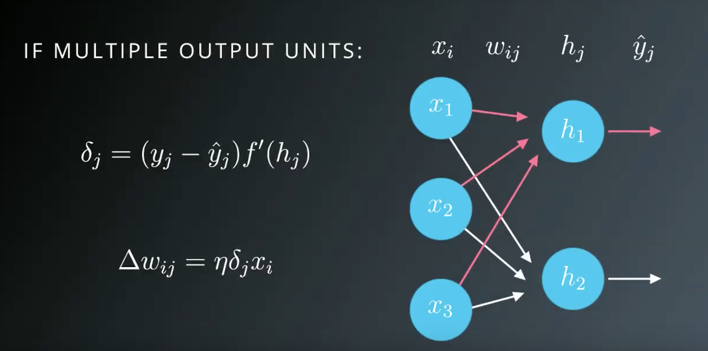

